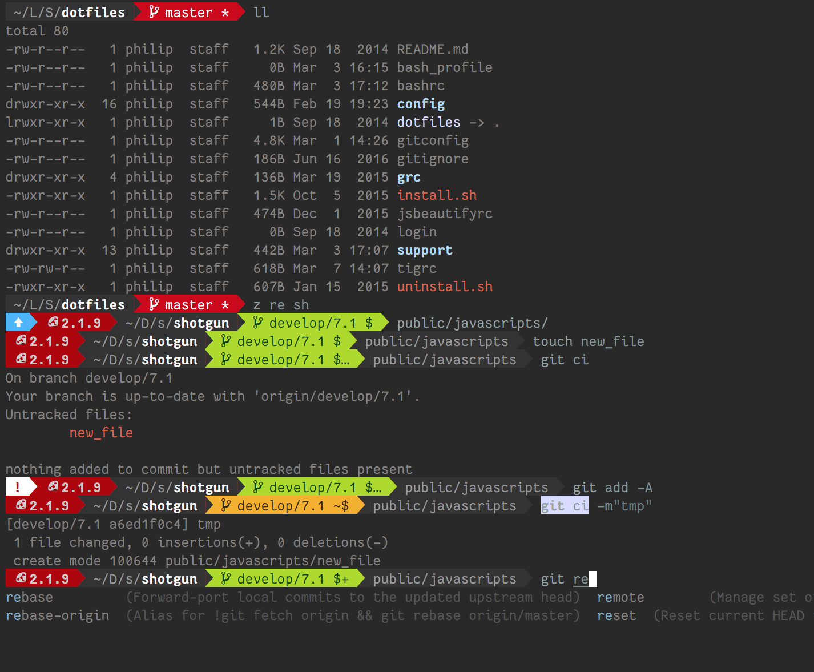

nemoDreamer dotfiles
====================

A terminal setup, heavily modified from [thoughtbot/dotfiles](https://github.com/thoughtbot/dotfiles).

Fully loaded with:

- 1-step install
- full uninstall
- [Homebrew](https://brew.sh), because duh.
- [Fishshell](https://fishshell.com), instead of Bash
- [Oh-My-Fish](https://github.com/oh-my-fish/oh-my-fish), for bundle management
- The _delicious_ [BobTheFish](https://github.com/oh-my-fish/theme-bobthefish) prompt
- The mysterious [z](https://github.com/rupa/z), for directory _'frecency'_
- The amazing [tig](https://github.com/jonas/tig), a terminal-based Git GUI
- and OMG like so much more!

---

## Installation

- Clone repo into directory of your choice (I recommend `~/Library/Scripts/.`)
- Run `./install.sh`

This will symlink dotfiles and all its contents into your home directory. _You can safely run `./install.sh` multiple times to update._

**NOTE:** you'll also want a [Nerd-Patched PowerLine FontTM](https://github.com/ryanoasis/nerd-fonts)

## Uninstallation

You can safely uninstall all dotfiles symlinks by running `~/.dotfiles/uninstall.sh`.

## Make your own customizations

Put your customizations at the top of files, separated by `DO NOT EDIT BELOW THIS LINE`.

For example, the top of your `~/.gitconfig` might look like this:

    [user]
      name = Oompah Loompah
      email = loompaho@example.com

    # DO NOT EDIT BELOW THIS LINE

    [push]
      default = current

The top of your `~/.login` might look like this:

    # Productivity
    alias todo='$EDITOR ~/.todo'

    # DO NOT EDIT BELOW THIS LINE

    # recommended by brew doctor
    export PATH="/usr/local/bin:/usr/local/sbin:$PATH"

Testing GitHub GraphQL API v4
